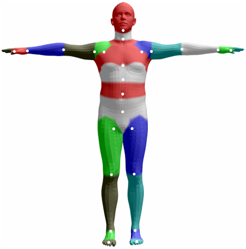

# Skeleton-based

## SMPL
```
SMPL_KEYPOINTS = [
    'pelvis',
    'left_hip',
    'right_hip',
    'spine_1',
    'left_knee',
    'right_knee',
    'spine_2',
    'left_ankle',
    'right_ankle',
    'spine_3',
    'left_foot',
    'right_foot',
    'neck',
    'left_collar',
    'right_collar',
    'head',
    'left_shoulder',
    'right_shoulder',
    'left_elbow',
    'right_elbow',
    'left_wrist',
    'right_wrist',
    'left_hand',
    'right_hand',
]
```
<center></center>

**NOTE 1:** The collection of skeleton-based human models (https://github.com/open-mmlab/mmhuman3d/tree/main/mmhuman3d/core/conventions/keypoints_mapping)<br>
**NOTE 2:** The SMPL paper (https://files.is.tue.mpg.de/black/papers/SMPL2015.pdf)<br>
**NOTE 3:** `SMPL_blender_addon` (Video: https://www.youtube.com/watch?v=DY2k29Jef94; Code: https://github.com/Meshcapade/SMPL_blender_addon/tree/main)<br>

- Comments
    - Might need to merge some joints, or assign the same motion to several joints?
    - Can we teach the LLM how to generate pseudo codes to control SMPL models? Or rather, how to use `SMPL_blender_addon`? Or rather, the skeleton codes of SMPL? $\rightarrow$ Related work: [Real-time Animation Generation and Control on Rigged Models via Large Language Models](https://github.com/Whalefishin/LLM_animation)