### Model: gpt-4-turbo-2024-04-09

1. **Motion: A man raises both arms above his head**
    - User:
        ```
        This series of images show a consecutive motion. Imagine the whole motion, and choose the most effective way to describe it in a fine-grained manner (no need to describe each image), with reference to the coarse-grained description 'A man raises both arms above his head'. If the image conflicts with the coarse-grained description, refer to the image as the gold standard.
        The standard of fine-grained is: 1. State in chronological order and step by step. 2. Specify spatial position changes (including angle changes) of relevant body parts. 3. Not specify any information related to muscles.
        ```
    - Images: 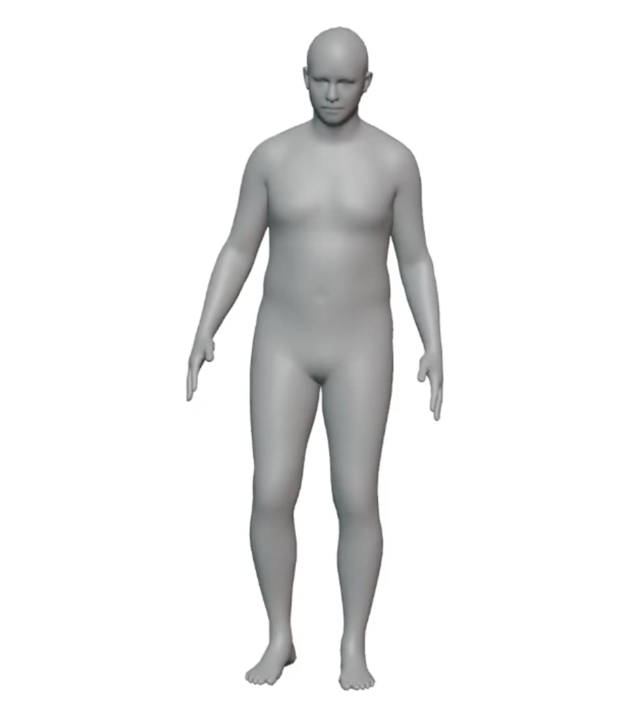 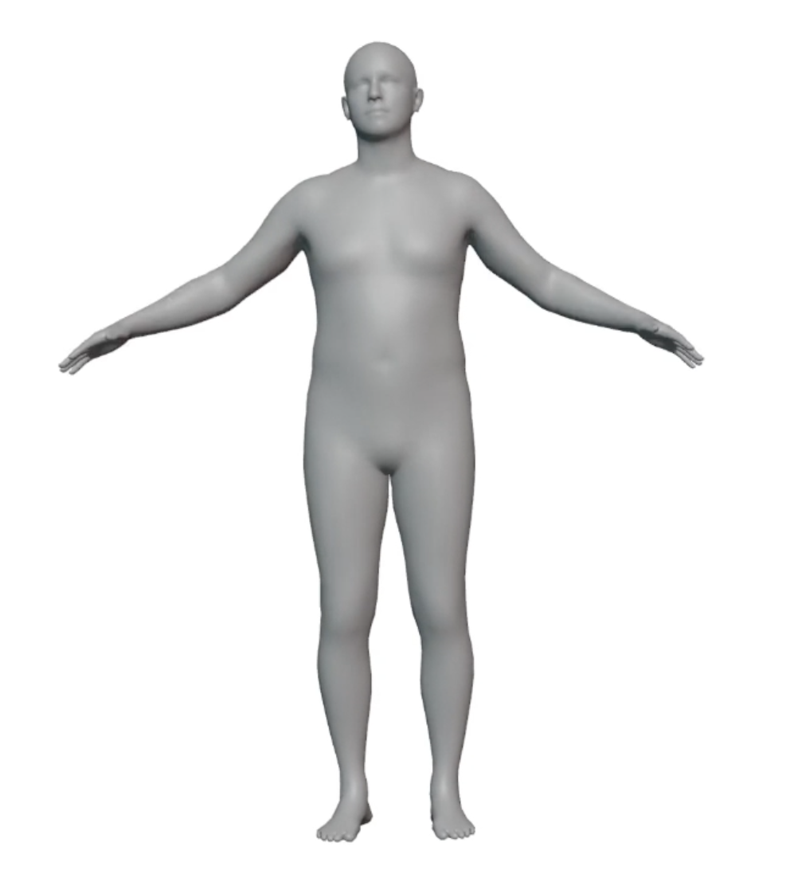 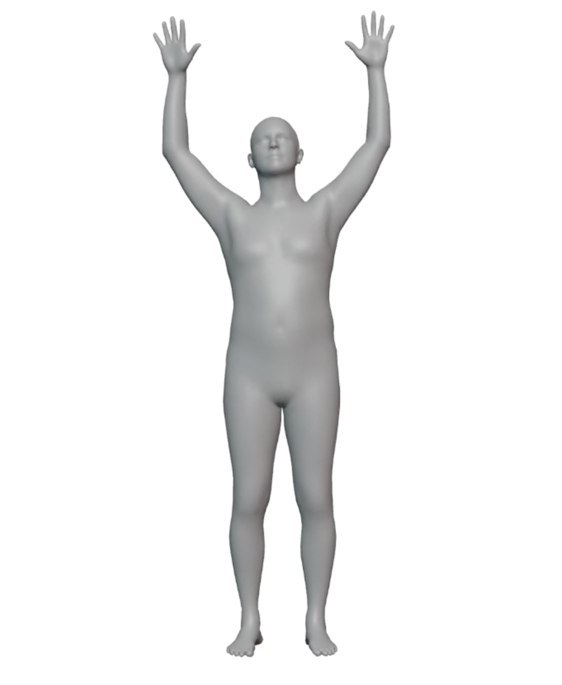 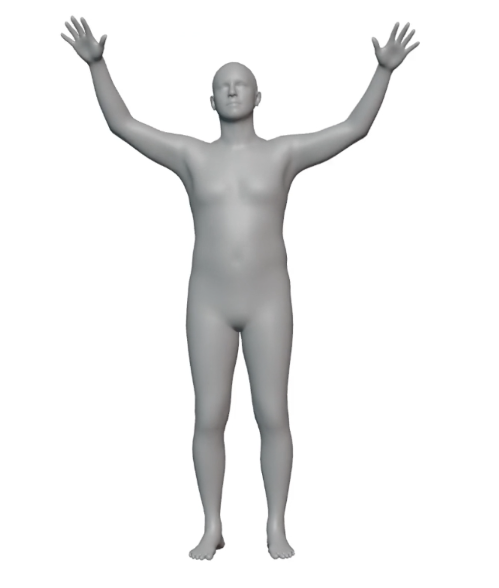 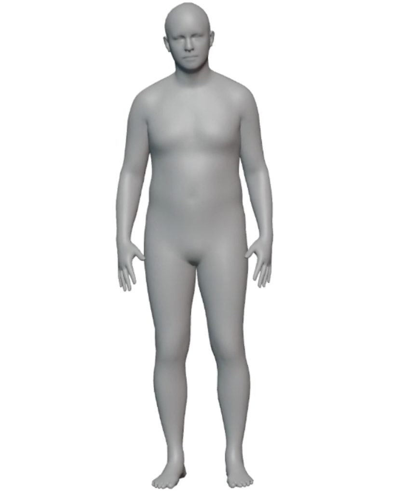
    - Outputs
        ```
        The motion illustrated in the images can be described in a detailed, sequential order as follows:
        
        1. Initial Position: The man starts with his arms straight by his sides, standing upright. His arms are fully extended downwards along the line of his body, palms facing inwards.
        
        2. Arm Extension to Side: Next, the man lifts both arms outward from his sides to reach a horizontal position at shoulder height. His arms are straight, extended to either side of his body, aligning parallel to the ground, and the palms are facing downward.
        
        3. Arms Raised Upwards: Continuing the motion, the man raises his arms from the horizontal side position straight up above his head. His arms follow a vertical path until they are fully extended upwards, as high as possible, oriented straight with palms facing each other.
        
        4. Arms Branch Outward: Once his arms reach their peak height, he then spreads both arms slightly outward from the straight upward position. The arms form a "V" shape, each arm angled slightly away from the head while remaining extended.
        
        5. Return to Initial Position: Finally, he lowers his arms back down directly beside his body to return to the initial standing position, with arms straight by his sides.
        
        This sequence describes the complete motion of the man raising his arms above his head and then returning to the original position, with attention to the changes in the spatial position and orientation of his arms throughout the movement.
        ```

2. **Motion: A man slightly squats**
    - User:
        ```
        This series of images show a consecutive motion. Imagine the whole motion, and choose the most effective way to describe it in a fine-grained manner (no need to describe each image), with reference to the coarse-grained description 'A man slightly squats'. If the image conflicts with the coarse-grained description, refer to the image as the gold standard.
        The standard of fine-grained is: 1. State in chronological order and step by step. 2. Specify spatial position changes (including angle changes) of relevant body parts. 3. Not specify any information related to muscles.
        ```
    - Images: 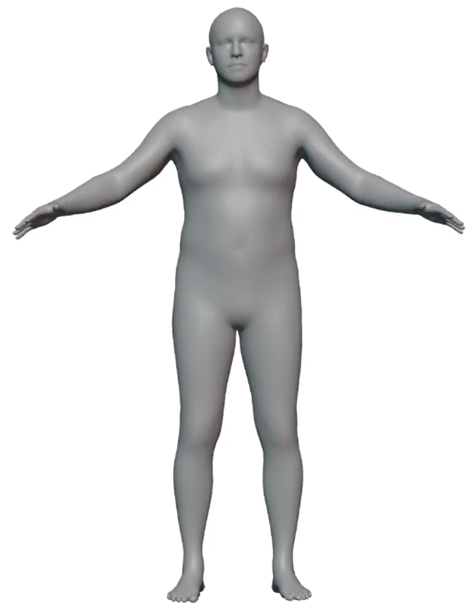 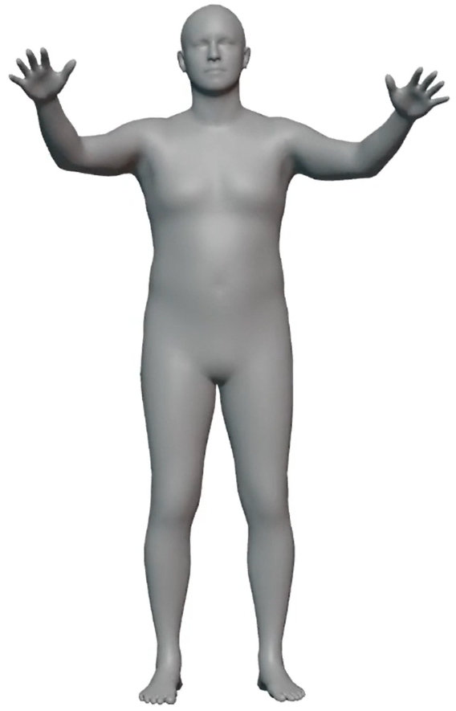 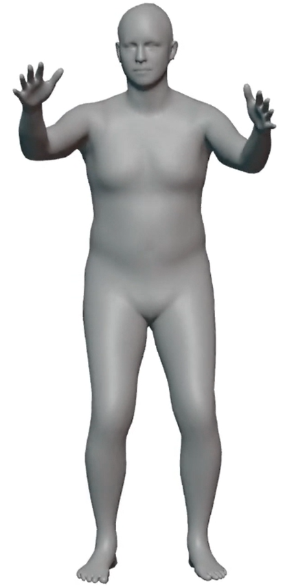 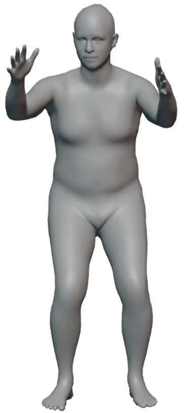 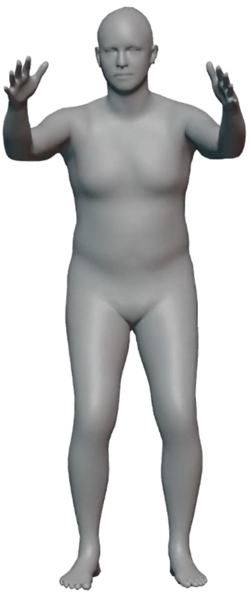 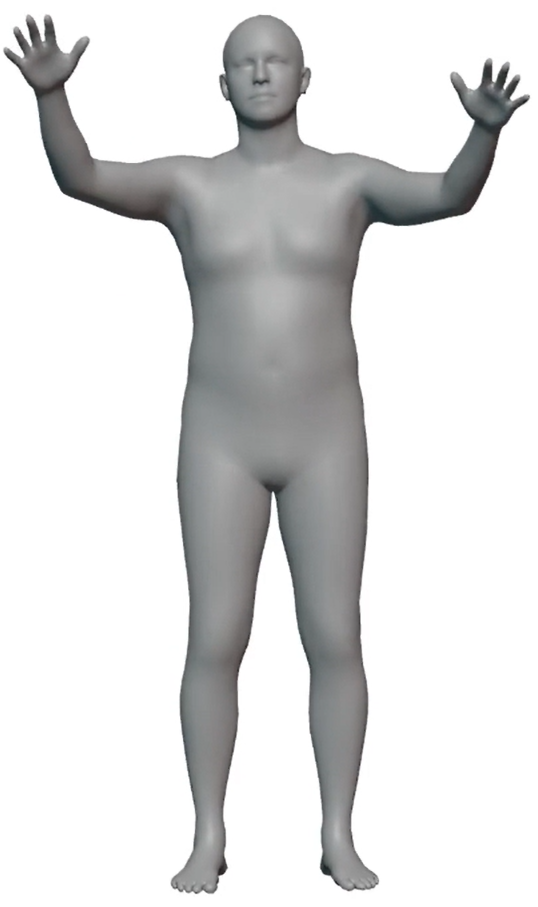 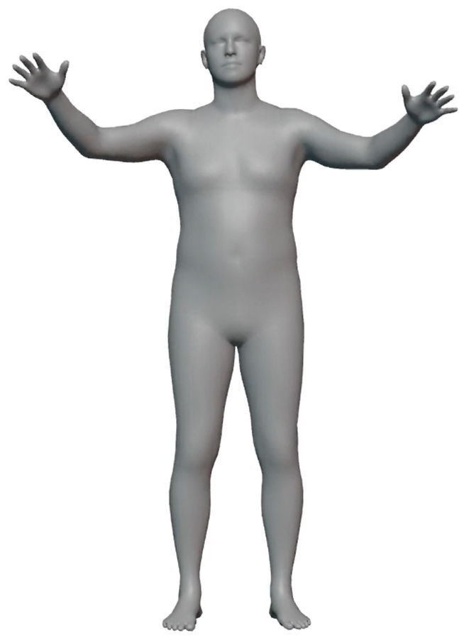 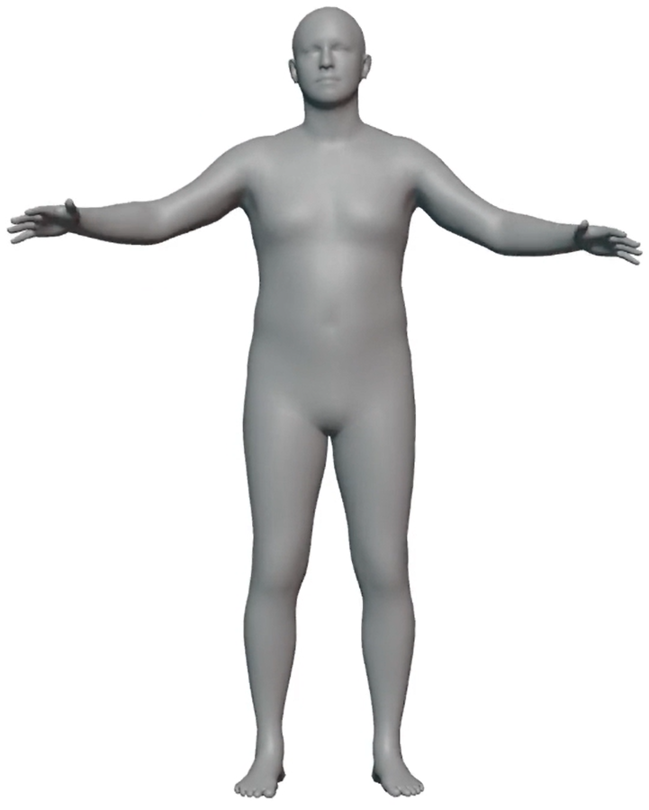 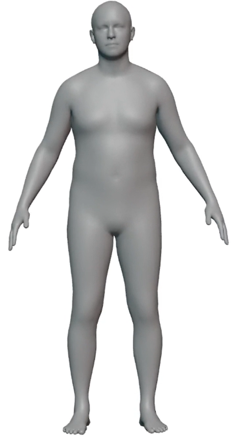
    - Outputs
        ```
        The sequence of images shows a man performing a motion that begins and ends with a neutral standing position and includes various arm movements. Here is a detailed description in chronological order:
        
        1. The man starts in a neutral standing position with arms extended sideways at about shoulder height.
        2. The arms are then moved upward to a position where the hands are slightly above and in line with the shoulders. Elbows are bent at right angles.
        3. Arms and hands maintain their upward, bent position, shifting slightly outward while the hands move further upward.
        4. The arms start to straighten, lifting further upwards while still slightly angled outwards, expanding the angle between arms and torso.
        5. Arms continue to rise straight above the head with palms facing outward; elbows are near full extension.
        6. Starting the reverse of the previous motion, the arms are lowered to a level slightly above horizontal, maintaining an outward orientation of the palms.
        7. Arms continue to descend and are now positioned at shoulder height, elbows slightly bent, palms facing outward.
        8. Arms further lower to return to the initial position, extended straight at shoulder height to the sides.
        
        Throughout this sequence, the torso remains mostly erect, and the legs maintain a vertical, neutral stance. The entire movement consists of smooth, coordinated arm movements, primarily involving elevation and depression along with slight rotations at the shoulders.
        ```

#### Analysis
1. Using **GPT-4-turbo with both textual instructions and key-frame motion images** generates fine-grained descriptions that align much better than GPT-3.5-turbo with only textual instructions.
2. Sometimes GPT-4-turbo cannot correctly understand the motion in the images (e.g., it cannot recognize the squat in Case 2 above) -> Solutions: We might need to use the original skeleton-based figure? Or utilizing models that accept videos?
3. Regarding the output, what kind of formats do we expect? The current fine-grained descriptions are too free in formats. Maybe we can ask the model to generate fine-grained temporal-spatial-timeline descriptions that combine the ideas from the following two images. The idea of decomposition into atomic descriptions can also be easier applied in this format (iterate on some sub-descriptions when necessary).
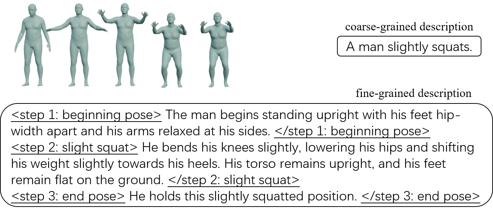https://arxiv.org/abs/2403.13518
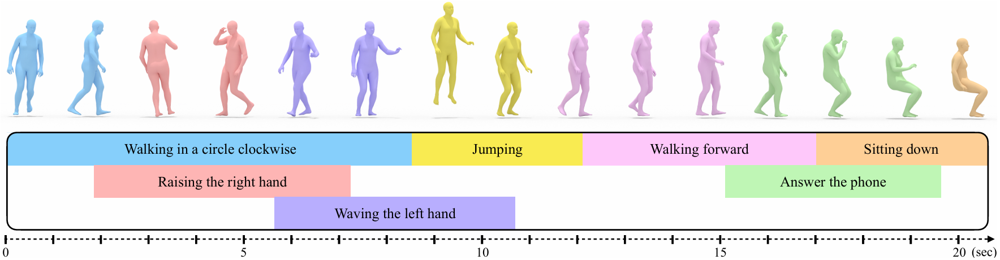
https://arxiv.org/abs/2401.08559